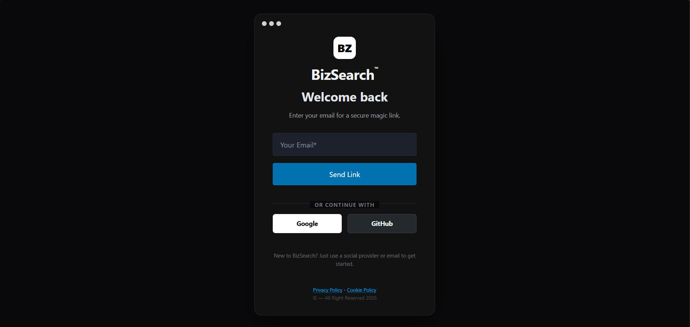
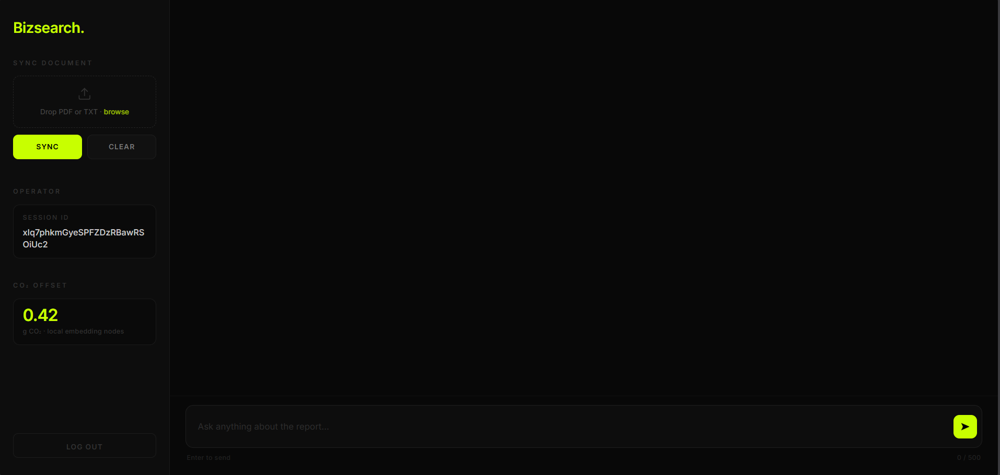

# BizSearch: Enterprise AI Document Engine

## Overview

BizSearch is a lightweight, high-performance Retrieval-Augmented Generation (RAG) application. It allows users to securely upload documents, instantly vectorize the text, and query their proprietary data using natural language.

Built entirely in Python using FastHTML, the application bypasses complex JavaScript frameworks to deliver a reactive, single-page application (SPA) experience. It features native cloud authentication, real-time database tracking, and enterprise-grade vector search capabilities.

## Core Features

### Retrieval-Augmented Generation (RAG): Upload PDF or TXT files to instantly create a searchable vector index. Query the document using natural language with near-instant generation.

### Hypermedia-Driven UI: Built with FastHTML and customized CSS, providing a seamless, fast, and responsive dark-mode interface without relying on heavy frontend frameworks like React or Vue.

### Secure Authentication: Integrates Firebase Authentication to provide passwordless Magic Links and OAuth identity providers (Google and GitHub).

### Real-Time Usage Tracking: Utilizes Firebase Realtime Database to track user sessions, enforce high-compute daily query limits (5 queries per standard user), and maintain lifetime usage metrics.

### Environmental Metrics Tracker: Calculates and displays a personalized "CO2 Offset Score" per user session based on local embedding node usage.

## Technical Stack

Backend & Frontend Engine: Python, FastHTML, FastAPI

Authentication & Cloud Storage: Firebase Admin SDK, Firebase Client JS

AI Engine & Orchestration: LlamaIndex

Large Language Model (LLM): Groq API (Llama 3)

Vector Database & Embeddings: ChromaDB / Pinecone, Google Generative AI Embeddings

Document Parsing: PyPDF, docx2txt

### Installation and Setup

1. Clone the repository

git clone https://github.com/YOUR_USERNAME/BizSearch.git
cd BizSearch

2. Install dependencies

pip install -r requirements.txt

3. Configure Environment Variables
   Create a .env file in the root directory of the project and populate it with your specific API keys and configuration URLs:

# AI and Vector Services

GROQ_API_KEY=your_groq_api_key
GOOGLE_API_KEY=your_google_api_key
PINECONE_API_KEY=your_pinecone_api_key

# Firebase Configuration

FIREBASE_DB_URL=https://your-project-id.firebaseio.com/
FIREBASE_API_KEY=your_client_api_key
FIREBASE_AUTH_DOMAIN=your-project-id.firebaseapp.com
FIREBASE_PROJECT_ID=your-project-id
FIREBASE_STORAGE_BUCKET=your-project-id.appspot.com
FIREBASE_MESSAGING_SENDER_ID=your_sender_id
FIREBASE_APP_ID=your_app_id

# Application Security

SESSION_SECRET_KEY=generate_a_secure_random_string
MASTER_USER_ID=your_admin_email@domain.com
